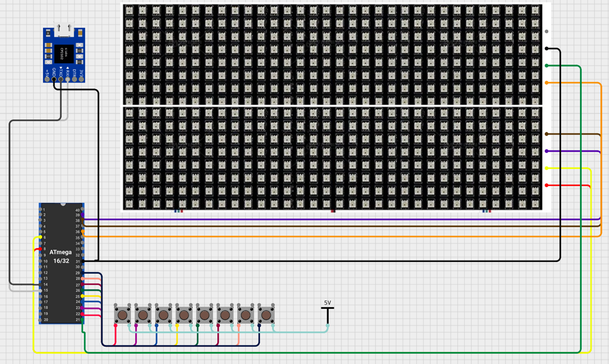
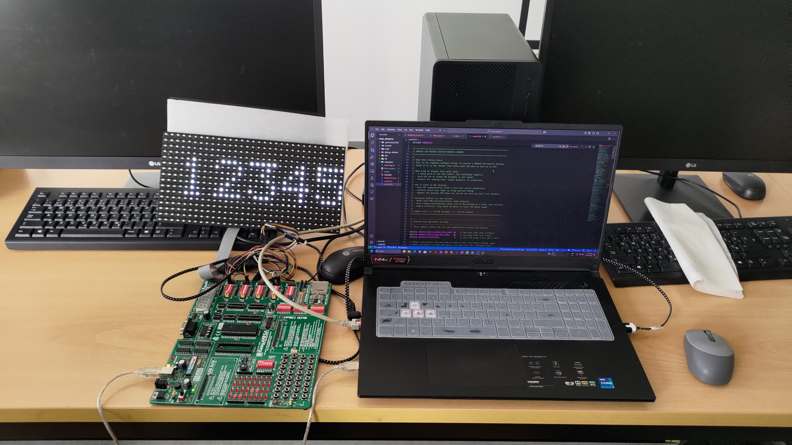

# VMA419 LED Matrix Display Controller

A complete embedded systems project for controlling a 32×16 LED matrix display using ATmega16 microcontroller with scrolling text, button controls, and UART communication.

## 📋 Project Overview

This project implements a professional-grade LED matrix display controller that can:
- Display scrolling text messages
- Accept new messages via UART/Serial communication
- Control scroll speed, direction, and text position using physical buttons
- Maintain smooth 250Hz refresh rate for flicker-free display
- Support real-time message updates without interrupting display operation

### 🎯 Key Features

- **Real-time Text Display**: Smooth scrolling text with customizable speed and direction
- **UART Communication**: Send new messages via serial terminal
- **Button Controls**: 5 physical buttons for speed, direction, and position control
- **High Performance**: Hardware SPI communication for optimal display refresh
- **User-Friendly**: Clear feedback via UART for all button operations
- **Professional Code**: Well-documented, beginner-friendly codebase

## 🖼️ Project Photos

### Hardware Setup

*Complete hardware setup showing ATmega16 microcontroller, VMA419 LED matrix display, control buttons, and wiring connections*

### Display in Action

*VMA419 LED matrix display showing scrolling text in operation*

## 🎥 Project Video

### Demonstration Video
https://github.com/user-attachments/assets/e241327a-3fa3-472f-962a-384655966364

*Complete demonstration showing scrolling text, button controls, UART communication, and all features in action*

> **Note**: If the video doesn't play directly in GitHub, you can download it from the `image/Video.mp4` file to view locally.

## 🔧 Hardware Requirements

### Main Components
- **Microcontroller**: ATmega16 (or compatible AVR)
- **Display**: VMA419 32×16 LED Matrix Display
- **Buttons**: 5x Push buttons for user controls
- **Communication**: UART/USB-to-Serial adapter
- **Power Supply**: 5V DC power source

### Pin Connections

#### VMA419 Display Connections
| VMA419 Pin | ATmega16 Pin | Function |
|------------|--------------|----------|
| VCC | +5V | Power supply |
| GND | GND | Ground |
| A | PA1 | Row select A |
| B | PA2 | Row select B |
| LATCH | PA4 | Data latch |
| OE | PD7 | Output enable |
| MOSI | PB5 | SPI data (hardware SPI) |
| SCK | PB7 | SPI clock (hardware SPI) |

#### Button Connections
| Button Function | ATmega16 Pin | Description |
|----------------|--------------|-------------|
| Speed Up | PC0 | Increase scroll speed |
| Speed Down | PC1 | Decrease scroll speed |
| Direction Toggle | PC2 | Change scroll direction |
| Text Up | PC6 | Move text up |
| Text Down | PC7 | Move text down |

#### UART Communication
| Signal | ATmega16 Pin | Function |
|--------|--------------|----------|
| TXD | PD1 | Serial transmit |
| RXD | PD0 | Serial receive |

*Note: All buttons should be connected with pull-up resistors (10kΩ) and debouncing capacitors (100nF) for reliable operation.*

## 🚀 Quick Start Guide

### 1. Hardware Setup
1. Connect the VMA419 display according to the pin connection table
2. Wire all 5 control buttons with proper pull-up resistors
3. Connect UART pins for serial communication
4. Apply 5V power to the system

### 2. Software Setup
1. Clone or download this project
2. Open the project in MPLAB X IDE
3. Configure your programmer (USBASP, STK500, etc.)
4. Build and upload the firmware to ATmega16

### 3. First Run
1. Power on the system
2. The display should show "WELCOME ERASMUS STUDENTS"
3. Open a serial terminal (9600 baud, 8N1)
4. Test button controls and UART communication

## 🎮 User Controls

### Physical Buttons
- **PC0 (Speed Up)**: Makes text scroll faster (minimum: 5ms delay)
- **PC1 (Speed Down)**: Makes text scroll slower (maximum: 100ms delay)
- **PC2 (Direction)**: Toggles between left-to-right and right-to-left scrolling
- **PC6 (Text Up)**: Moves text up (Y position 0-15)
- **PC7 (Text Down)**: Moves text down (Y position 0-15)

### UART Commands
- **Send any text**: Replace the scrolling message with your custom text
- **Maximum length**: 31 characters per message
- **Real-time update**: Message changes immediately without stopping the display

### Serial Terminal Settings
- **Baud Rate**: 9600
- **Data Bits**: 8
- **Parity**: None
- **Stop Bits**: 1
- **Flow Control**: None

## 💾 Project Structure

```
Final_Project.X/
├── main.c                 # Main program with button handling and UART
├── vma419.c              # VMA419 display driver implementation
├── vma419.h              # VMA419 driver header and API
├── VMA419_Font.h         # 5×7 pixel font definitions and text rendering
├── fesb_logo.h           # FESB logo bitmap data
├── Makefile              # Build configuration
├── README.md             # This documentation
└── nbproject/            # MPLAB X project files
    ├── configurations.xml
    ├── project.xml
    └── Makefile-*.mk
```

## 🔬 Technical Details

### Display Technology
- **Resolution**: 32×16 pixels (512 total LEDs)
- **Color**: Monochrome red LEDs
- **Refresh Rate**: 250Hz (flicker-free)
- **Multiplexing**: 4-phase row scanning
- **Memory Usage**: 64 bytes frame buffer

### Communication Protocol
- **SPI Interface**: Hardware SPI for optimal performance
- **Clock Speed**: Maximum (fosc/4) for fastest data transfer
- **Data Format**: MSB first, compatible with VMA419 shift registers

### Performance Specifications
- **Display Update**: ~250μs per full scan cycle
- **Button Debouncing**: 200ms debounce period
- **UART Buffer**: Circular buffer with overflow protection
- **Memory Footprint**: ~2KB flash, ~100 bytes RAM

## 🛠️ Development Environment

### Required Software
- **MPLAB X IDE**: v6.00 or later
- **XC8 Compiler**: v2.40 or later
- **Serial Terminal**: PuTTY, Tera Term, or Arduino Serial Monitor

### Build Instructions
1. Open MPLAB X IDE
2. Open the project folder
3. Select your target device (ATmega16)
4. Configure programmer settings
5. Build project (Build → Build Project)
6. Program device (Run → Run Project)

### Debugging Tips
- Use UART output for debugging (all button presses send feedback)
- Check power supply stability (5V ±0.25V)
- Verify SPI connections for proper display operation
- Ensure proper button debouncing circuit

## 📚 Code Documentation

### Main Functions

#### Display Control
```c
vma419_init()               // Initialize display system
vma419_clear()              // Clear all LEDs
vma419_set_pixel()          // Control individual LEDs
vma419_scan_display_quarter() // Refresh display (call continuously)
```

#### Text Rendering
```c
vma419_font_draw_char()     // Draw single character
vma419_font_draw_string()   // Draw text string
vma419_font_draw_string_centered() // Center text on display
```

#### Communication
```c
USART_Init()               // Initialize serial communication
USART_SendString()         // Send text via UART
USART_Receive()            // Receive characters from UART
```

### Key Variables
```c
scroll_text[32]            // Current display message
scroll_position            // Horizontal text position
scroll_speed               // Delay between scroll steps
scroll_direction           // -1 (left) or +1 (right)
text_y_offset             // Vertical text position
```

## 🔧 Customization Options

### Changing Font
- Edit `VMA419_Font.h` to modify character patterns
- Each character is 5×7 pixels stored as bitmap data
- Add new characters by extending the font array

### Adjusting Display Timing
- Modify scroll speed range in button handlers
- Change refresh rate by adjusting delay in main loop
- Optimize SPI speed in `vma419.c`

### Adding New Features
- Extend UART protocol for more commands
- Add more button functions
- Implement different text effects (blink, fade, etc.)

## 🐛 Troubleshooting

### Common Issues

**Display not working:**
- Check 5V power supply
- Verify SPI pin connections (MOSI=PB5, SCK=PB7)
- Ensure ground connections

**Buttons not responding:**
- Check pull-up resistors (10kΩ)
- Verify debouncing capacitors (100nF)
- Test button debounce timing

**UART communication issues:**
- Confirm baud rate (9600)
- Check TX/RX pin connections
- Verify serial terminal settings

**Flickering display:**
- Ensure stable power supply
- Check refresh rate timing
- Verify SPI signal integrity

## 🎓 Educational Value

This project demonstrates key embedded systems concepts:

- **Hardware Interfacing**: SPI, GPIO, UART communication
- **Real-time Systems**: Continuous display refresh with user interaction
- **Memory Management**: Efficient frame buffer usage
- **User Interface Design**: Button debouncing and feedback
- **Modular Programming**: Clean separation of display, font, and main logic

Perfect for embedded systems courses, microcontroller programming learning, or portfolio projects!

## 📄 License

This project is open-source and available for educational use. Feel free to modify and improve the code for your own projects.

## 👨‍💻 Author

**Authors**: Arnold Dsouza & Miłosz Markiewicz  
Embedded Systems Project  
Date: June 2025

---

*For questions or improvements, please create an issue or submit a pull request.*
